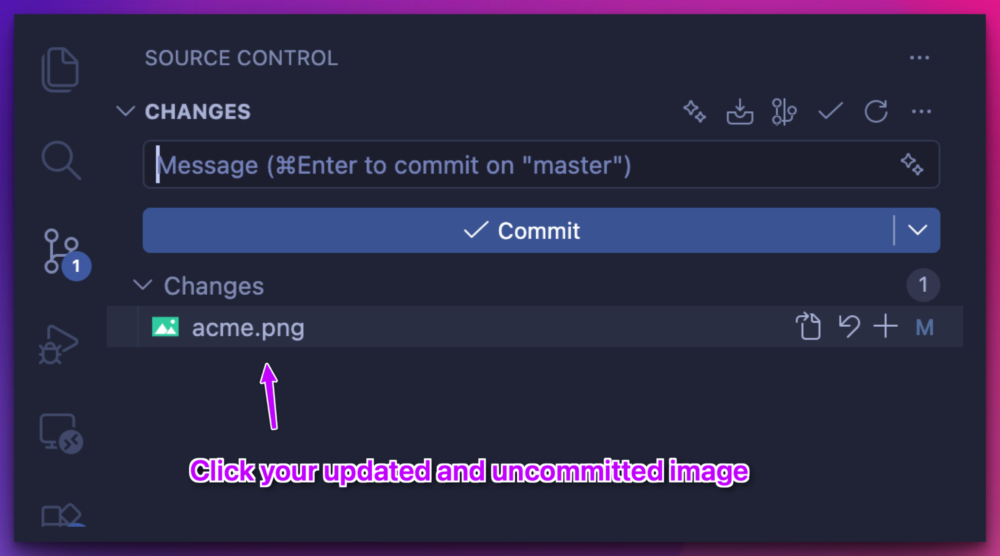
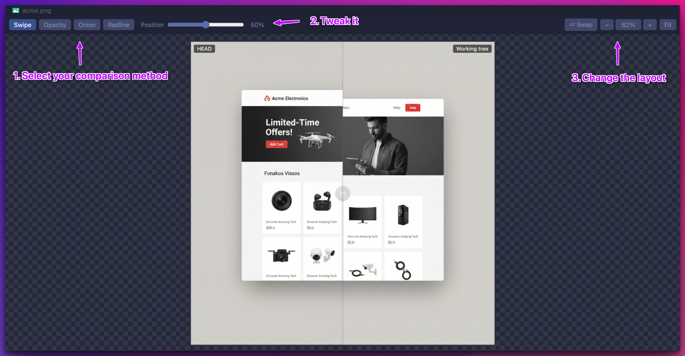

# SnapDiff

A VS Code extension that visually compares the **uncommitted changes** to an image against its
committed (`HEAD`) version — the way design tools diff mockups. `git diff` can't show binary images,
and the built-in preview shows only one version at a time. This puts both side by side in four modes.

## Modes

| Mode | What it does |
| --- | --- |
| **Swipe** | Drag a divider to reveal before/after across the same frame. |
| **Opacity** | Cross-fade slider blends the committed and working versions. |
| **Onion skin** | Auto ping-pong fade between before/after to catch subtle shifts (adjustable speed). |
| **Redline** | Per-pixel difference; changed pixels are highlighted over a dimmed base. |

It compares **working tree vs `HEAD`**. Open it from the lens button in an image's title bar, or
right-click an image in the **Explorer** or a changed image in **Source Control** →
**Compare Image with SnapDiff** (also in the command palette). Unchanged or untracked images fall
back to a plain single view.

## How it works

**1. Open a changed image from Source Control.** Click any modified image in the Source Control panel.

**2. Click the SnapDiff icon** in the editor title bar of the built-in image diff.

**3. Compare.** Pick a mode — swipe, opacity, onion skin, or redline — tweak it, and adjust the layout.

## Settings

- `snapDiff.startupMode` — initial mode (`swipe` | `opacity` | `onion` | `redline`).
- `snapDiff.diffThreshold` — per-channel sensitivity for Redline (0–255).
- `snapDiff.highlightColor` — Redline highlight color.
- `snapDiff.onionSpeed` — onion-skin cross-fade cycles per second.
